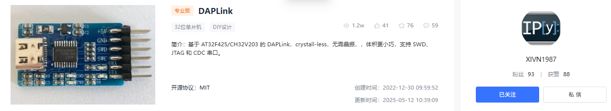
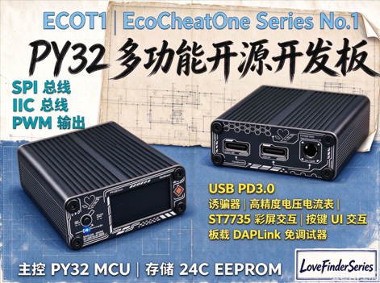
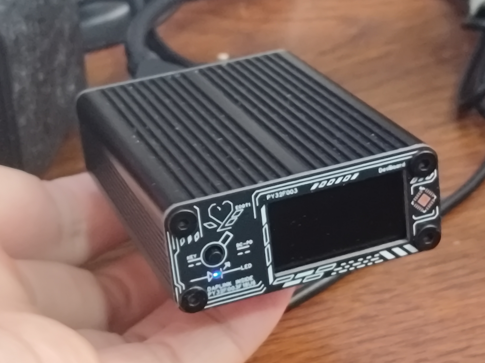
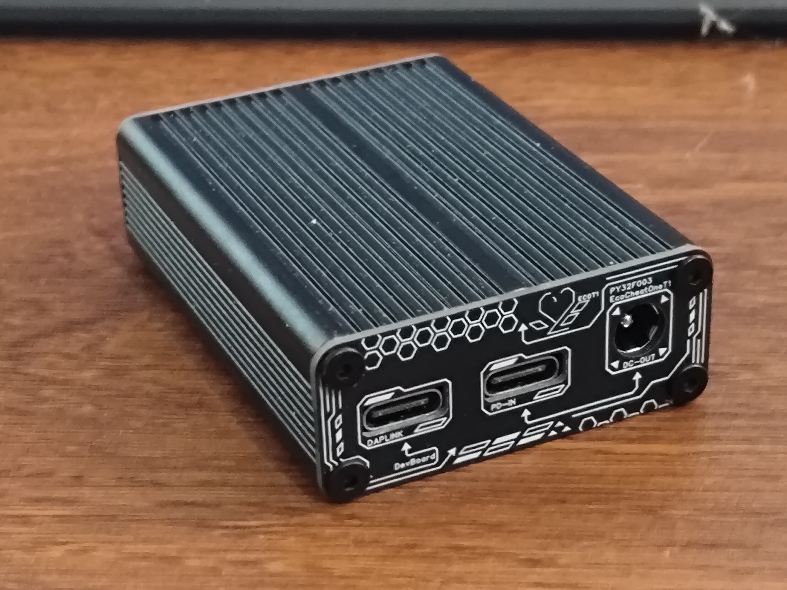
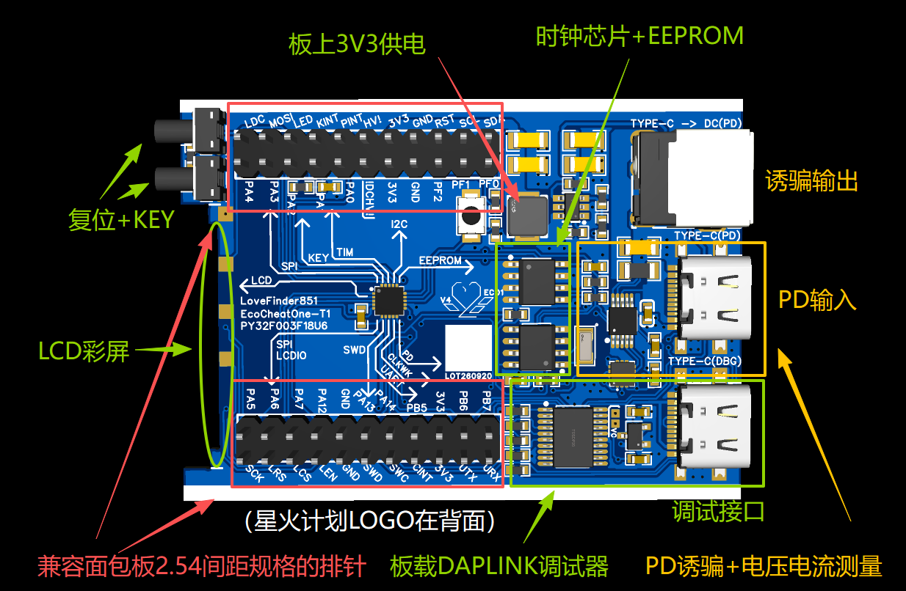
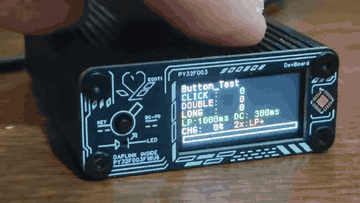
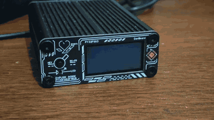
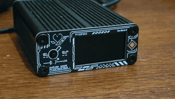
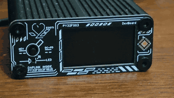
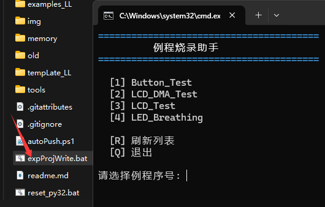

前排感谢：https://oshwhub.com/xivn1987/daplink
这个工程促成了板载调试器部分的开发，对板载调试器部分实现感兴趣的请直接访问这个工程并为他点击点赞收藏，谢谢

同样的，依据作者开源协议，对于属于这个开源工程的元器件将遵循原作者的协议，本工程其他部分保持CC BY-NC-SA 4.0协议，请勿侵占版权







## 更新日志
2026.9.23 初次发布

## EcoCheatOne
# PY32 经济型多功能开发板：PD 诱骗 + 电压电流表 + 数字闹钟 + DAPLink

&gt; 一块面向 PY32 入门学习、外设覆盖全面、同时又能直接当成品用的小型开发板。  
&gt; 板载 PY32F003F1U6、FUSB302、INA226、CH32V203 DAPLink、RTC、EEPROM、ST7735 SPI 彩屏等，配铝壳与前后 IO 面板，既能学习，也能落地成完整方案。  
&gt; **目前已完成首批 LL 库例程：呼吸灯、按键测试、屏幕测试（硬件 SPI / SPI+DMA）。**

---



例程介绍：









还提供例程烧录助手，想看效果直接帮你编译烧录！
(需要把PY32LL库和本工程放在同一目录下，并且安装好Keil)




---

## 项目简介

这是一块基于 **PY32F003F1U6** 的经济型开发板，围绕“学习入门 PY32 + 板载丰富外设 + 可直接做成小成品”的思路设计。

它不只是一块最小系统板，而是一套相对完整的硬件方案：

- 板载 **DAPLink 调试器**，基于 CH32V203，无需额外购买调试器
- 板载 **FUSB302**，可学习并实现 **USB PD 3.0 诱骗**
- 板载 **INA226**，可做 **电压电流监测**，甚至实现库伦电量计
- 板载 **RTC 时钟芯片**，可开发 **数字闹钟 / 定时提醒**
- 板载 **EEPROM 位置**，可焊接 24Cxx，做数据存储、密码管理等
- 板载 **ST7735 160×80 SPI 彩屏**
- 板载 **按键、LED、PWM 呼吸灯** 等基础外设
- 配 **铝合金外壳 + 完整前后 IO 面板**，可直接当成品使用
- 主板排针间距经过优化，**可直接插面包板调试**，也方便接逻辑分析仪和外设

简单说：  
**想学 PY32，它能当开发板；想直接用，它能当 PD 诱骗器、电压电流表、数字闹钟、密码管理器。**

---

## 开源链接

- **工程本体开源链接**：
- **PY32 LL 库（正在维护）**：
- **屏幕 PCB 开源链接**：  
  &gt; 屏幕单独焊接在一块小 PCB 上，再与主板 PCB 焊接。请选择 **“R”版本**。
- **壳体购买链接（JLCFA）**：

---

## 已完成例程（LL 库）

当前仓库 `examples_LL` 目录下已提供以下例程，全部基于 LL 库编写，方便贴近寄存器与底层外设学习：

```text
examples_LL/
├── LED_Breathing      # 呼吸灯
├── Button_Test        # 按键测试：单击 / 双击 / 长按
├── LCD_Test           # 屏幕测试：硬件 SPI
└── LCD_DMA_Test       # 屏幕测试：SPI + DMA
```

### 1. LED_Breathing — 呼吸灯

- 使用 PWM 控制 LED 亮度
- 实现渐亮渐灭的呼吸效果
- 适合学习：GPIO 复用、定时器 PWM、占空比调节

### 2. Button_Test — 按键测试

- 支持 **单击、双击、长按** 识别
- 适合学习：GPIO 输入、外部中断、按键消抖、状态机
- 可作为 UI 交互基础

### 3. LCD_Test — 屏幕测试（硬件 SPI）

- 驱动 ST7735 160×80 SPI 彩屏
- 使用硬件 SPI 刷屏
- 适合学习：SPI 时序、屏幕初始化、绘图接口

### 4. LCD_DMA_Test — 屏幕测试（SPI + DMA）

- 在硬件 SPI 基础上引入 DMA
- 降低 CPU 占用，提高刷屏效率
- 适合学习：DMA 配置、SPI+DMA 联合使用、刷屏优化

&gt; 后续计划继续补充：I²C 外设（INA226 / RTC / EEPROM）、PD 诱骗、DAPLink、数字闹钟、电压电流表等例程。  
&gt; 相关底层支持持续维护在 **LoveFinderLibForPY32_LL**：  
&gt; 

---

## 功能与场景

### 1. SPI 彩屏

板载 **ST7735 160×80 彩屏**，走 SPI 接口。  
可用于：

- 显示电压、电流、功率
- 显示时间、闹钟状态
- 显示 PD 协商电压
- 做简单 UI 菜单
- 学习 SPI 驱动与图形刷新

已提供 **硬件 SPI** 与 **SPI+DMA** 两种例程。

&gt; 屏幕单独焊接在一块小 PCB 上，再与主板 PCB 焊接。  
&gt; 屏幕 PCB 开源链接：  
&gt; 请选择 **“R”版本**。

### 2. PD 诱骗

板载 **FUSB302**，支持 USB PD 3.0 协商。  
通过 TYPE-C 接口接入 PD 电源，可诱骗出目标电压，再从 **DC-044 接口** 输出给负载取电。

适合：

- 学习 USB PD 协议
- 做 PD 诱骗器
- 给外设供电
- 配合 INA226 做 PD 电压电流监测

### 3. 按键与 LED 基础外设

前置面板包含：

- 1 个通用按键，连接 MCU
- 1 个 MCU 复位按键
- 1 个 LED，支持 PWM 呼吸灯

已提供 **呼吸灯** 与 **按键单击 / 双击 / 长按** 例程。

适合学习：

- GPIO 输入输出
- 外部中断
- PWM 调光
- 按键消抖与状态机

### 4. 数字闹钟

板载 RTC 时钟芯片，基于 **32.768 kHz 石英晶体**，可提供：

- 年、月、日、星期、时、分、秒
- 世纪标志位
- 室温下 1.0V 至 5.5V 工作电压
- 低备份电流：典型值 0.25μA（VDD = 3.0V，Tamb = 25℃）
- 400kHz 两线 I²C 总线接口（VDD = 1.8V 至 5.5V）
- 可编程时钟输出：32.768 kHz、1.024 kHz、32 Hz、1 Hz
- 报警和定时器功能
- 集成振荡器电容
- 内置上电复位电路
- I²C 从机地址：读操作 A3h，写操作 A2h
- 开漏中断引脚

可以直接开发：

- 数字闹钟
- 定时喝水提醒
- 番茄钟
- 简单日程提醒

### 5. 电压电流表

板载 **INA226**，用于监测 PD 诱骗链路上的电压和电流。  
配合屏幕可显示：

- 电压
- 电流
- 功率
- 累计电量 / 库伦计

适合学习：

- I²C 通信
- 传感器数据读取
- 校准与滤波
- 电量累计算法

---

## 外设学习路径

这块板子覆盖了从基础到进阶的多个学习层次：

### 1. 基本 IO 学习

- 按键：中断方式，支持单击 / 双击 / 长按
- LED：PWM 呼吸灯
- 复位按键
- 基础 GPIO 控制

### 2. 通信 IO 学习

- SPI：驱动 ST7735 彩屏，含硬件 SPI 与 SPI+DMA
- I²C：驱动 INA226、RTC、EEPROM
- 串口通信：调试、上位机通信

### 3. 高级通信学习

- USB PD 3.0：FUSB302 协议协商
- PD 诱骗：电压请求与电源管理
- DAPLink：调试接口与下载

### 4. 单片机调试

- 板载 **基于 CH32V203 的 DAPLink**
- 用户不需要自带调试器
- 可直接下载、调试 PY32

---

## 硬件细节

### 主控

- **PY32F003F1U6**

### 外壳与面板

- 铝合金外壳：**45 × 19 × 60 mm**（60 为长度，19 为高度）
- 有完整前后 IO 面板
- 可直接作为成品使用
- 壳体购买链接（JLCFA）：

### 前置面板

- 1 个通用按键，连接 MCU
- 1 个 MCU 复位按键
- 1 个 LED，支持 PWM 呼吸灯
- 1 块 ST7735 160×80 SPI 彩屏

### 后置接口

- 1 个 **DC-044**：PD 诱骗输出口
- 2 个 **TYPE-C**：
  - TYPE-C 接口 1：调试接口，板载 CH32V203 DAPLink
  - TYPE-C 接口 2：板子供电输入口，支持耐压到 20V，可接入 PD 电源

### PD 诱骗与监测链路

- PD 电源从 TYPE-C 接口 2 输入
- FUSB302 负责 PD 协商
- 诱骗输出到 DC-044
- 用户可在 DC 接口接入负载取电
- 电源实际来自 PD 电源
- INA226 监测这条链路上的电压电流
- 可通过软件实现库伦电量计

### 时钟芯片

- 基于 32.768 kHz 石英晶体
- 提供年、月、日、星期、时、分、秒
- 包含世纪标志位
- 工作电压范围：室温下 1.0V 至 5.5V
- 低备份电流：典型值 0.25μA（VDD = 3.0V，Tamb = 25℃）
- 400kHz 两线 I²C 总线接口（VDD = 1.8V 至 5.5V）
- 可编程时钟输出：32.768 kHz、1.024 kHz、32 Hz、1 Hz
- 具备报警和定时器功能
- 集成振荡器电容
- 内置上电复位电路
- I²C 总线从机地址：读操作 A3h，写操作 A2h
- 开漏中断引脚

### EEPROM

- 板上预留 EEPROM 位置
- 可焊接 24Cxx 作为数据存储
- 可用于保存设置、密码、校准参数等

### 排针与调试

- 主板上有 2 排排针
- 间距经过优化设计
- 有丝印指示所有引脚
- 每个引脚至少都有 2 个排针
- 可同时接入逻辑分析仪和外挂设备
- 可直接不搭配特制前后面板和铝壳，安装在面包板上做调试

### 电源

- 3V3 电源来自祖传 **JW5026**
- 耐压高达 40V
- 实际上从 PD 输入的 VBUS 上接入
- 因此无论诱骗是否启用（5V 或 5–20V 输入），都能保持全范围工作

---

## 可直接实现的完整方案

这块板子本身也是一个完整方案，配完整外壳和前后面板，可以直接做：

### 1. PD 诱骗 + 电压电流表

- TYPE-C 接入 PD 电源
- FUSB302 协商诱骗电压
- DC-044 输出给负载
- INA226 监测电压电流
- 屏幕显示实时数据

### 2. 数字闹钟

- RTC 提供时间
- 屏幕显示时间与闹钟状态
- 按键设置闹钟
- 可做定时喝水提醒、番茄钟等

### 3. 个人密码管理器

- 编写上位机
- 通过串口通信到板上
- 数据存储到 EEPROM
- 可做简单密码保存与管理

---

## 适合谁

- 想入门 PY32 单片机的初学者
- 想学习 SPI、I²C、PD 协议、DAPLink 的开发者
- 想做一个 PD 诱骗 + 电压电流表的小工具
- 想做一个桌面数字闹钟
- 想做一个简单密码管理器
- 想用一块板子覆盖多种外设学习场景的人

---

## 项目亮点总结

- **经济型 PY32 开发板**
- **板载 DAPLink**，无需额外调试器
- **板载 FUSB302**，可学 PD 3.0 诱骗
- **板载 INA226**，可做电压电流表与库伦计
- **板载 RTC**，可做数字闹钟
- **板载 EEPROM 位置**，可做数据存储
- **ST7735 SPI 彩屏**，支持硬件 SPI 与 SPI+DMA
- **按键 + LED + PWM 呼吸灯**
- **已提供 LL 库例程**：呼吸灯、按键单击/双击/长按、LCD 硬件 SPI、LCD SPI+DMA
- **持续维护的 PY32 LL 库**：
- **铝壳 + 完整前后 IO 面板**
- **排针优化，可直接插面包板**
- **JW5026 供电，耐压 40V，支持 5–20V 输入范围工作**

---

## 例程目录说明

```text
examples_LL/
├── LED_Breathing      # 呼吸灯：PWM 调光
├── Button_Test        # 按键测试：单击 / 双击 / 长按
├── LCD_Test           # 屏幕测试：硬件 SPI
└── LCD_DMA_Test       # 屏幕测试：SPI + DMA
```

后续计划补充：

- I²C 例程：INA226 电压电流读取
- I²C 例程：RTC 时间读写与闹钟
- I²C 例程：24Cxx EEPROM 读写
- FUSB302 PD 诱骗例程
- 数字闹钟完整方案
- PD 诱骗 + 电压电流表完整方案
- 串口上位机 + EEPROM 密码管理方案

---

## 开源说明

本项目计划开源到开源电路社区，欢迎交流、复刻与改进。

- 主控：PY32F003F1U6
- 调试器：CH32V203 DAPLink
- PD 控制器：FUSB302
- 电压电流监测：INA226
- 显示：ST7735 160×80 SPI 彩屏
- 时钟：32.768 kHz RTC
- 存储：24Cxx EEPROM
- 电源：JW5026
- 例程库：LL 库

### 相关链接

- **工程本体开源链接**：
- **PY32 LL 库（正在维护）**：
- **屏幕 PCB 开源链接**：  
  &gt; 屏幕单独焊接在一块小 PCB 上，再与主板 PCB 焊接。请选择 **“R”版本**。
- **壳体购买链接（JLCFA）**：

&gt; 开源协议：待补充  
&gt; 原理图 / PCB / 固件：见工程本体开源链接  
&gt; 外壳与面板文件：见壳体购买链接与工程仓库

---

## 结语

这是一块“学习 + 实用”双定位的 PY32 开发板。  
它既能带你从按键、LED、SPI、I²C 一路学到 PD 3.0 和 DAPLink，也能直接装进铝壳，变成 PD 诱骗器、电压电流表、数字闹钟或密码管理器。

目前已完成 **呼吸灯、按键测试、LCD 硬件 SPI、LCD SPI+DMA** 四个 LL 库例程，后续会继续补齐 I²C、PD 诱骗与完整方案例程。  
底层支持持续维护在 **LoveFinderLibForPY32_LL**，工程本体、屏幕 PCB 与壳体链接也已在文中给出，欢迎复刻、交流与改进。

如果你也在找一块外设丰富、体积小巧、能学也能用的 PY32 板子，欢迎关注这个项目。